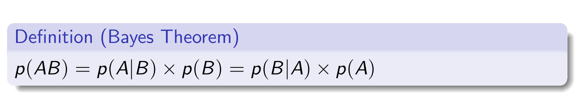

Markov Definition

Markov Property

Why Discounting is a good idea

Bellman Equation

Direct solution of Bellman Equation

Solve bellman equation directly

Iterative policy evaluation

Optimal Policy and optimal value and Q function

Three Assumption for BOE

Convergence Rule

Dynamic Programming

Two assumption of DP

1. MDP to be finite
2. A perfect model for environment, means we know the trasition and reward function

For every states ⇒

In short, update value function using policy untill value function converge, then be greedy to update the policy, then go back to step 2 untill the policy converge.

**Policy Iteration Algorithms**

**Value Iteration Algorithms**

If value of all states are updated same time or individually

Why value iteration is guranteed to converge

Monte Carlo

First Visit MC vs Evert Visit MC

Batch VS Online Monte-Carlo

No Need to store samples traces

Temporal Difference Learning

MC update the value using the actual return R, where dp use the estimated return to update the value

What is Markov Property

MC Control

Why use model free control

On-policy vs off-policy

Means we have a policy that gives a non-zero probablity to all possible actions

Epsilon Greedy

TD Control

Difference between online and offline learning

| Aspect          | Offline Learning                                     | Online Learning                                         |
|------------------|-----------------------------------------------------|--------------------------------------------------------|
| Data            | Pre-collected dataset (fixed and static).            | Dynamically collected through interaction with the environment. |
| Interaction     | No interaction during training (training is offline).| Continuous interaction and learning during training.   |
| Updates         | Policy/value function is updated using the dataset once or iteratively (batch learning). | Policy is updated incrementally after every interaction. |
| Adaptability    | Not adaptive to new environments unless retrained.   | Adaptive to changing environments in real-time.        |
| Exploration     | Limited to what the dataset covers (no active exploration). | Actively explores to discover new states and actions.  |

**SARSA**

**Q-learning**

Target policy and behaviour policy

For on policy method, same policy is used to generate episode and to optimise. However, for off-policy method, the target policy are the one use to optimise and behaviour policy are the one used to generate episode.

Function Approximation

The estimates make the estimates closer to the real V/Q value, but not reach the real V/Q value, in the end, it will get close enough to the true V/Q value.

DQN

**Experience Reply Algorithmes**

Clipping Rewards: Varation in rewards maeks the training unstable ⇒ Clip positive reward to 1, and negative reward to -1

Skipping Frame to reducing computational cost and accelerating training times.

Dobule Q network

Normal netowork will produce a maximisation bias

Use the main netowrk instead of the target network to do action selection (compared with normal target network)

Target Network

Double Q network provide prediction that are closer to the final value and more stable and less biased.

Policy Gradient

Why using policy based method:

For some environment that has large action space (especially continous action space), iterate through all actions might take a long time, thus have a policy that direct output action would be more efficient.

Objective of Policy Gradient

Finit difference are simple, inefficient(especially when have tons of parameters), and sometime efficient (it can even work for non-differentiable ones)

Directly calculating the policy gradient

REINFORCE algorithms

REINFORCE algorithms suffer greatly from variance, a single erratic trajectory can cause a suboptimal shift into wired area of optimisation.

Gussian Policy

Policy gradients is trial-and-arror (like MC)

The action in future cannot affect the actions in the past.

Actor Critics

Policy based method has low bias but larger variance

TD Error

- Generate the trace
- Update the policy value
- calcualte the TD error
- update the Q value error

Advantage Actor Critic (A2C)

A3C is the parallel and asynchronous version of A2C, the there is a global network which takes the gradient of each agent, and the agent will sometimes update their states according to global network.

